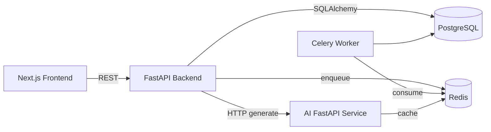

# ProShare v1.0 Architecture

## Integration contracts
- `POST /articles/{id}/summary` triggers AI summary generation/fetch.
- Redis keys follow `article:{id}:summary:{method}`.
- AI service returns `summary` plus disclaimer.

## Deployment notes
- Render/Fly/AWS/GCP deployments can reuse container images from module Dockerfiles.
- Use managed PostgreSQL + Redis in production.
